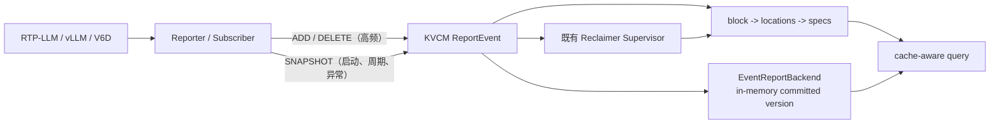
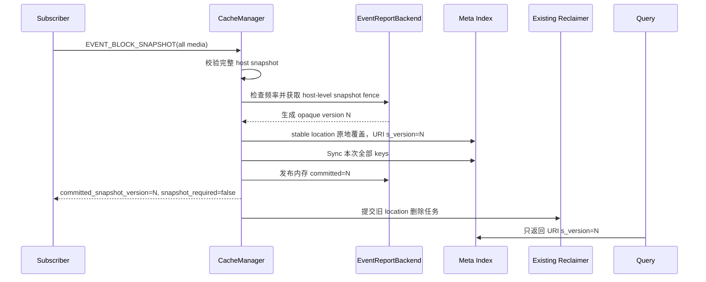

# ReportEvent 增量上报与权威快照对账设计

> 状态：待设计评审。
> 本文描述目标语义；设计确认后再继续修改代码和测试。

## 1. 一句话说明

ReportEvent 使用两条互补链路同步 KV Cache 元数据：

- 日常变化走 `EVENT_BLOCK_ADD` / `EVENT_BLOCK_DELETE`；
- 启动、周期校准、事件断档等场景走 `EVENT_BLOCK_SNAPSHOT`。

Snapshot 是一个 reporter 在某一时刻、跨全部介质的完整 cache 事实，不是增量补丁，也不是历史版本存档。

### 1.1 核心设计原则

1. **增量负责效率，快照负责收敛。** ADD/DELETE 优化稳态写放大，snapshot 则是能够覆盖
   增量历史的权威事实；系统正确性不能永久依赖每一条增量事件都不丢失。
2. **一致性边界跟随权威写入者。** 一个 reporter 独占维护某个 instance 在本机上的全部
   cache 状态，因此版本、互斥栅栏、限频和失效都以该写入者为单位；存储介质只是这份
   状态内部的属性，不是独立的一致性域。
3. **可见性由提交版本决定，而不是由物理写入完成度决定。** KVCM 先把新版本写入 URI，
   全部写入成功后才发布 committed token；查询只接受 token 匹配的数据，旧数据或失败
   写入留下的数据都不可被误认为当前事实。
4. **逻辑版本与物理位置解耦。** location id 保持稳定，版本只承载可见性，不制造一套
   新的物理 location identity。这样避免 copy-on-write 的双份位置和两阶段替换，同时
   明确接受缓存场景下“失败后等待下次 snapshot 收敛”的可用性取舍。
5. **查询正确性不依赖清理及时性。** 版本过滤先保证旧数据不可见，reclaimer 只负责
   异步回收空间；清理延迟或 KVCM 在清理中重启都不能重新暴露旧版本。
6. **重启恢复依赖源端重建事实。** committed token 只保存在内存并通过响应反馈给
   Subscriber。KVCM 重启后所有 reporter 必须重新提交完整 snapshot，不从残留 metadata
   猜测或恢复旧的权威状态。

## 2. 要解决的问题

只发增量的成本最低，但进程重启、网络中断、事件丢失或 Subscriber 基线损坏后，KVCM 可能长期保留已经不存在的 block。

只发全量容易收敛，但高频执行会反复重写所有 block，并放大 Redis 和后台清理负载。

因此目标是：

- 稳态成本与实际变化量成正比；
- 低频 snapshot 能权威修复增量链路漂移；
- 未提交版本不能被查询当成当前事实；
- Subscriber 能明确知道 KVCM 当前 committed version；
- KVCM 重启后要求全部 reporter 重新上报 snapshot，不恢复旧版本；
- 旧数据复用既有 reclaimer 删除，不再维护一套 snapshot 专用任务框架。

## 3. 在整体架构中的位置

KVCM 是 KV Cache metadata control plane，不传输真实 KV tensor，也不替代 Master/FlexLB 做最终调度。



职责边界：

- Engine Adapter 负责获得可信输入；
- Subscriber 负责事件顺序、源端 watermark、重试、snapshot barrier 和 ACK 后推进本地基线；
- KVCM 负责版本生成、元数据写入、内存发布点、查询过滤、节点生命周期和旧 metadata 回收；
- Master/FlexLB 根据 KVCM 的 cache-aware candidates，再结合健康状态和实时负载做最终决策。

Engine 的 cache version、event sequence 或 epoch 与本文的 KVCM snapshot version 是不同概念：

- source watermark 证明 Engine 快照与后续事件的先后关系；
- KVCM snapshot version 标识哪一轮 metadata 对账已经提交。

## 4. Scope 的推导：以权威写入者为一致性边界

### 4.1 先确定谁对数据负责

Snapshot 要回答的不是“某种介质上有哪些 block”，而是：

> 某个 cache reporter 此刻声明自己负责的完整 cache 集合是什么？

在当前部署模型中，一个 Subscriber/reporter 统一观察同一 instance 在一台推理节点上的
GPU、CPU 和 Disk cache，并负责把这台节点的变化按序上报给 KVCM。它是这组 metadata
的唯一权威写入者，也是发生重启、断连、HOST_DOWN 和重新注册的生命周期单元。

因此，一致性 scope 定义为：

```text
snapshot scope = instance_id + reporter host_ip_port
```

两个字段分别解决不同的隔离问题：

- `instance_id` 隔离不同模型实例或 cache namespace；
- `reporter host_ip_port` 标识该 instance 下独立的写入者和故障域。

这里的 `host_ip_port` 是 reporter identity，不只是物理机器地址。设计要求同一 scope 同时
只能有一个活跃写入者；如果未来同一节点允许多个进程独立拥有 cache，必须为它们分配
不同的 reporter identity，或显式扩展 scope，不能让多个写入者共用一个 token。

### 4.2 为什么 medium 不属于 scope

`medium` 决定 block 位于 HBM、DRAM 还是 Disk，是数据的寻址和放置属性，但它不是独立
的写入者、故障域或生命周期单元。同一个 reporter 能在同一时刻观察全部介质，所以一份
host snapshot 应当同时声明全部介质的事实。

如果把 `medium` 放进 scope，会产生并不需要的中间状态：例如 HBM 已提交 v2、DRAM 仍停
留在 v1，查询看到的是同一 reporter 不同时刻的拼接结果；Subscriber 还必须分别维护多套
token、重试和栅栏。对当前单 reporter 架构而言，这既没有增加真实性，也削弱了“完整
host snapshot”的含义。

所以 `medium` 只保留在 `BlockSnapshotItem` 和 stable location id 中，不参与：

- committed version 状态；
- snapshot 频率限制；
- snapshot/delta 并发栅栏；
- scope 生命周期和失效。

### 4.3 Scope 带来的协议约束

由上述所有权边界直接得到以下约束：

- 同一 scope 的 GPU、CPU、Disk 必须在一个 snapshot 中完整上报并共享同一个 committed
  token；空 `blocks` 表示该 reporter 的全部介质均为空。
- 同一 scope 内 snapshot 与 delta 必须互斥，避免 snapshot 基线与其间增量互相覆盖；
  不同 scope 没有共同写入者，可以并行执行。
- REGISTER 只刷新已有 reporter 的存活状态，不重置 token；HOST_DOWN、显式注销或 KVCM
  重启会使 scope 的 committed token 失效，重新注册后必须先完成新 snapshot。
- 限频按 scope 执行，防止单个异常 reporter 影响其他节点。
- location id 仍包含 `medium`，因为查询和清理需要定位物理介质；这与版本 scope 是否包含
  `medium` 是两个不同问题。

`host_ip_port` 必须取自 `ReportEventRequest.host_ip_port`。数据 URI 的 host 可能是实际
存储服务地址，不能替代 reporter identity。

## 5. Snapshot 协议

### 5.1 Medium 下沉为 block 属性

一个 host snapshot 使用一个 `EVENT_BLOCK_SNAPSHOT` item。外层不再携带 `medium`，每个 block 自己声明 medium：

```protobuf
message BlockSnapshotItem {
    string block_key = 1;
    string medium = 2;
    repeated LocationSpec specs = 3;
}

message BlockSnapshotEventParams {
    repeated BlockSnapshotItem blocks = 1;
}
```

该协议仍处于新开发阶段，没有历史兼容负担，因此直接采用最自然的字段顺序，不保留旧外层 medium。Java、C++、HTTP JSON 文档和客户端必须同步更新。

示例：

```json
{
  "instance_id": "model-a",
  "host_ip_port": "10.0.0.8:9000",
  "storage_type": "ST_EVENT_REPORT",
  "events": [
    {
      "event_type": "EVENT_BLOCK_SNAPSHOT",
      "block_snapshot": {
        "blocks": [
          {
            "block_key": "101",
            "medium": "hbm",
            "specs": [
              {
                "name": "full_attention",
                "uri": "rtp-llm://10.0.0.8:9600/hbm/101"
              }
            ]
          },
          {
            "block_key": "102",
            "medium": "mem",
            "specs": [
              {
                "name": "full_attention",
                "uri": "rtp-llm://10.0.0.8:9600/mem/102"
              }
            ]
          }
        ]
      }
    }
  ]
}
```

### 5.2 完整性语义

一次 `EVENT_BLOCK_SNAPSHOT` 是该 reporter 全部 medium 的完整集合：

- 空 `blocks` 表示该 reporter 当前没有任何 cache；
- 未出现的 medium 表示该 medium 为空；
- 唯一键是 `(medium, block_key)`，同一组合不能重复；
- 每个 block 的 `specs` 是该 location 当前完整的组件集合；
- medium、spec name 不能为空；
- 同一 block 内 spec name 不能重复；
- URI 必须合法，且不能预带 KVCM 保留参数；
- 一个请求最多有一个 snapshot item；
- snapshot 不能与 ADD、DELETE、HOST_DOWN 混在同一请求；
- 同一 snapshot 不能拆成多个普通请求分页提交。

如果单请求无法承载大快照，后续应设计显式 Begin/Page/Commit staging 协议；不能把多个独立 snapshot 当分页。

## 6. Location 与 URI

### 6.1 Stable location id

location 仍按 block 的 medium 区分：

```text
kvs#event_report#<medium>#<reporter host_ip_port>
```

例如：

```text
kvs#event_report#hbm#10.0.0.8:9000
kvs#event_report#mem#10.0.0.8:9000
```

v1 更新到 v2 时，直接覆盖同一个 block 下该 stable location 的完整 specs。

明确删除下面的 copy-on-write 形式：

```text
kvs#event_report#<medium>#snapshot_v=<version>#<reporter host_ip_port>
```

实现中不再需要：

- versioned location id 的构造和解析；
- 新旧两代 location 并存；
- `BatchReplaceLocationSpecs` 的 create/replace 两阶段；
- 以 location generation 实现可见性切换。

Snapshot 写入使用单阶段的“按 stable location 覆盖完整 specs”操作。底层跨 key 仍不是事务，失败语义见第 10 节。

### 6.2 URI 只追加 s_version

KVCM 只在 reporter URI 上追加一个参数：

```text
s_version=<opaque version>
```

例如：

```text
rtp-llm://10.0.0.8:9600/hbm/101?s_version=018f4e3c-7d91-7b12-a3c4-5d6e7f809abc
```

instance、reporter 和 medium 已经分别存在于请求上下文、stable location id 和 `BlockSnapshotItem` 中，不需要在每个 spec URI 里重复保存。

要求：

- `s_version` 是 KVCM 保留参数，reporter 输入预带该参数时拒绝；
- 同一个 location 内的 specs 必须使用相同 `s_version`；
- 参数缺失、重复、非法或不等于当前 committed version 时 fail closed；
- scope 校验使用请求 instance 和 stable location id，不从物理 URI host 反推 reporter。

因此版本过滤必须放在同时拿得到 `instance_id + location_id + LocationSpec` 的 MetaSearcher/CacheManager 查询路径。只接收 `DataStorageUri`、看不到 location 上下文的 `EventReportBackend::MightExist` 不能再独立完成 scope/version 判定；它应接收显式 scope/token，或把这部分过滤交给上层。

## 7. Version 只保存在内存

每个 `(instance_id, reporter host_ip_port)` scope 在 `EventReportBackend` 中保存当前 committed version，不再写入 instance metadata。

版本仍使用不可复用的 opaque token，推荐 UUIDv7/128-bit：

- 查询只比较 `s_version == committed version`；
- Reclaimer 只比较 `s_version != committed version`；
- Subscriber 不依赖 version 大小排序；
- KVCM 重启后生成的新 token 不会碰巧复用旧 token。

不能在重启后从 1 重新计数。否则旧 metadata 中相同数字的 `s_version` 可能被重新激活。随机且不可复用的 token 解决这个问题，同时不需要 committed marker 或 allocated high-water。

KVCM 重启后：

1. 内存 committed version 为空；
2. 所有历史 event-report location 暂时不可见；
3. 所有 reporter 被标记为 `snapshot_required`；
4. reporter 必须重新发送一份完整 host snapshot；
5. snapshot 成功后发布新 token，并触发旧数据清理。

系统明确依赖 reporter 在 KVCM 重启后重新汇报，不从 Redis 恢复 snapshot version，也不扫描 block 猜 version。

## 8. Response：明确返回 committed version

`ReportEventResponse` 增加：

```protobuf
string committed_snapshot_version = 4;
uint64 retry_after_ms = 5;
bool snapshot_required = 6;
```

语义：

- snapshot 成功：返回本次新 token；
- snapshot 失败或 partial：返回失败前的 committed token；
- ADD、DELETE、REGISTER、HEARTBEAT：返回该 scope 当前 committed token；
- KVCM 启动后尚未收到该 reporter 的完整 snapshot：version 为空且 `snapshot_required=true`；
- 被频率限制时：同时返回当前 committed token 和建议等待时间。

Subscriber 以响应字段为准，不从 URI、时间戳或本地计数猜测 KVCM 当前版本。

`ReportEvent` 是批量接口，RPC 顶层 `ErrorCode` 只表达整批请求的聚合结果：同一批里既有成功事件又有需要重试的事件时可能返回 `EC_PARTIAL_OK`。Subscriber 不应把顶层 `EC_OK/EC_PARTIAL_OK` 当作 snapshot 是否 commit 的唯一依据；必须同时检查逐 event 结果以及 `committed_snapshot_version`、`snapshot_required`、`retry_after_ms`。特别地，只有返回的 committed token 与本次 snapshot ACK 对齐，才能认为本次 snapshot 已提交。

如果 mutation 已提交但 ACK 丢失，单写 Subscriber 重试时可以通过返回的 committed token 与自己的上一次已知 token 对比。即使无法确认，也可以稍后重发完整 snapshot，最终状态仍会收敛。

若运维需要不发 mutation 就读取 version，应在现有 host-state 查询接口中显式返回，而不是扫描 URI。

## 9. 写入与提交流程



严格顺序：

1. 完整校验 snapshot；
2. 检查 per-scope 最小间隔；
3. 获取 `(instance_id, reporter)` 的 snapshot fence；
4. 生成不可复用 version N；
5. 为全部 block 构造带 N 的 URI；
6. 按 stable location 单阶段覆盖完整 specs；
7. `Sync` 本次涉及的全部 keys；
8. 更新内存 committed=N，并清除 `snapshot_required`；
9. 返回 N；
10. 扫描旧 location，并把删除请求提交给既有 reclaimer supervisor。

步骤 8 是发布点：

- 之前查询只认可旧 committed；
- 之后查询只认可 N；
- 清理只能在 committed=N 成功后启动。

## 10. 原地覆盖与失败语义

本设计不再承诺 copy-on-write 的“失败时旧快照仍完整可读”。

假设当前 committed=C，新 snapshot=N：

- 已覆盖成 N 的 block 在 commit 前会被查询过滤；
- 尚未覆盖的 block 仍可能以 C 可见；
- 全部写入和 Sync 成功后才发布 N；
- N 发布后，本次上报的 N 数据可见；
- 未上报或失败残留的非 N 数据被过滤，随后由 reclaimer 删除。

失败矩阵：

| 失败位置 | committed 是否变化 | 查询表现 | 后续动作 |
| --- | --- | --- | --- |
| 校验失败 | 否 | 旧版本不变 | 修正请求 |
| 频率限制 | 否 | 旧版本不变 | 按 `retry_after_ms` 重试 |
| version/URI 准备失败 | 否 | 尚未写 metadata | 修正或重试 |
| 原地覆盖部分失败 | 否 | 已覆盖的 N 不可见，其余 C 可能可见 | 重试完整 snapshot |
| Sync 失败 | 否 | 同上 | 重试完整 snapshot |
| 内存发布前进程崩溃 | 否 | 重启后所有旧数据不可见 | reporter 重新上报 |
| 内存发布后进程崩溃 | 本进程已变，重启后清空 | 重启后所有旧数据不可见 | reporter 重新上报 |
| ACK 丢失 | 是 | N 已可见 | 查询响应 version 或重发完整 snapshot |
| 清理中崩溃 | 是 | N 可见，旧数据不可见但占空间 | 下次 snapshot 再触发清理 |

安全属性是“未提交 token 不会被当成当前 token”，不是“失败后旧快照始终完整”。

Cache 不是唯一副本，短暂的 cache miss 只会退化为重新计算或远端加载，因此该取舍可接受。

## 11. 查询规则

查询 event-report location 时检查：

1. 查询上下文提供 instance；
2. stable location id 能否解析出 medium 和 reporter；
3. URI 的 `s_version` 是否等于该 host scope 的内存 committed token；
4. reporter 是否已经完成重启后的必需 snapshot；
5. reporter 节点是否可用。

任一条件不满足，该 location 不可见。

兼容规则：

- 新部署且尚未启用 snapshot 的 legacy reporter，可以通过显式兼容开关读取无 `s_version` 的历史增量数据；
- 支持 snapshot 的 reporter 在 committed 为空或 `snapshot_required=true` 时不返回任何旧 location；
- host 完成 snapshot 后，只接受当前 committed token；
- snapshot 后的 ADD/DELETE 必须继承当前 committed token；
- URI 使用未知 token，即使格式合法也不可见。

查询过滤负责即时正确性；Reclaimer 只负责空间回收。

## 12. 跨请求栅栏与专用错误码

### 12.1 Host-level 栅栏

同一 `(instance_id, reporter)` scope 维护：

- 最多一个 `in_flight snapshot`；
- `active_delta_mutations` 引用计数；
- 当前 committed token。

规则：

- 有 active delta 时 snapshot 不能开始；
- snapshot in flight 时 ADD/DELETE 不能开始；
- delta lease 固定当前 committed token；
- delta URI 使用固定 token；
- 同一 reporter 的不同 medium 共用一把栅栏；
- 不同 reporter 或 instance 可以并行。

### 12.2 专用可重试错误码

新增协议错误码：

```protobuf
SNAPSHOT_IN_PROGRESS = 11;
DELTA_IN_PROGRESS = 12;
SNAPSHOT_RATE_LIMITED = 13;
SNAPSHOT_REQUIRED = 14;
```

建议内部错误码一一对应：

```text
EC_SNAPSHOT_IN_PROGRESS
EC_DELTA_IN_PROGRESS
EC_SNAPSHOT_RATE_LIMITED
EC_SNAPSHOT_REQUIRED
```

返回规则：

- snapshot 已在途，delta 请求返回 `SNAPSHOT_IN_PROGRESS`；
- delta lease 活跃，snapshot 请求返回 `DELTA_IN_PROGRESS`；
- 距离上次成功 snapshot 太近，返回 `SNAPSHOT_RATE_LIMITED` 和 `retry_after_ms`；
- KVCM 重启后、reporter 尚未重建基线时，REGISTER/HEARTBEAT 响应携带 `snapshot_required=true`，ADD/DELETE 返回 `SNAPSHOT_REQUIRED`；
- 字段非法仍返回 `INVALID_ARGUMENT`；
- 存储故障返回 `INTERNAL_ERROR` 或对应 IO 错误。

Subscriber 按错误类型处理：

- busy 错误使用短抖动退避；
- rate limited 等待 `retry_after_ms`；
- snapshot required 立即拉取并上报完整 host snapshot，成功前不发送 delta；
- invalid argument 不自动无限重试；
- snapshot 重试必须重发完整 host snapshot。

## 13. Snapshot 频率限制

`EventReportBackend` 为每个 host-level scope 维护最小 snapshot 间隔：

```text
snapshot_min_interval = 30s  // 默认值，可配置
```

语义：

- 首次 snapshot 不受限；
- 间隔从上一次成功 commit 计算，不从失败尝试计算；
- 写入或 Sync 失败后允许立即重试；
- REGISTER/HEARTBEAT/ADD/DELETE 不受 snapshot interval 限制；
- KVCM 返回剩余 `retry_after_ms`；
- Subscriber 仍应增加随机抖动，避免多个 host 整点同时上报。

频率限制主要防止 Subscriber bug 或错误配置把 full snapshot 当成高频轮询写接口。它不是 Subscriber 正常调度的替代品。

频率状态不持久化。KVCM 重启后必须先完成一次重建 snapshot，这次 snapshot 不受重启前的间隔限制；之后重新开始内存计时。

## 14. 清理复用现有 Reclaimer

### 14.1 不新增 snapshot 专用调度器

删除独立的 `ScheduleStaleSnapshotCleanup`、latest-version 合并表和专用退避重试状态。

snapshot commit 成功后：

1. 使用现有 MetaIndexer 分页扫描该 instance 的 block metadata；
2. 找出 reporter 属于当前 scope、URI `s_version` 不等于 committed=N 的 location；
3. 按现有 `CacheLocationDelRequest` 或等价删除请求分批；
4. 提交给现有 `reclaimer_task_supervisor_->Submit(...)`；
5. 删除、`EC_NOENT`、容量扣减和实际 metadata mutation 复用现有 reclaimer 路径。

Reclaimer 不解析 token 大小，只比较是否等于当前 committed token。

### 14.2 崩溃与重试

- 清理失败不影响查询正确性；
- 清理过程中 KVCM 崩溃，残留数据继续被 version filter 隐藏；
- 下一次成功 snapshot 再扫描并提交删除；
- HOST_DOWN 继续复用现有 host cleanup 与 node generation fencing；
- 不为 snapshot 另建内存重试队列；
- 现有 reclaimer 自身已有的任务保障可以复用，但本文不叠加第二套退避。

### 14.3 当前不引入反向索引

第一期不新增持久化 `location_id -> block_key set`，避免引入 Redis 双写一致性和恢复复杂度。

代价是每次 snapshot commit 后清理需要扫描 instance 的 `N` 条 block metadata。扫描是低频后台任务，查询正确性不依赖它。

必须监控扫描耗时、读取量和 backlog；当它持续超过阈值时，再以数据决定是否引入可 rebuild 的反向索引。

### 14.4 只删除 metadata

本 Reclaimer 删除 KVCM 中陈旧的 location/meta 引用。

物理 Cache Store 中 KV tensor 的释放仍由 Engine/Cache Store 生命周期负责。若未来需要 KVCM 主动删除远端物理 cache，应设计独立的鉴权、确认、幂等和重试协议。

## 15. 节点生命周期与恢复

- REGISTER：建立 reporter 和 medium 能力；若该 reporter 尚无本轮 KVCM 进程内 committed token，返回 `snapshot_required=true`；
- HEARTBEAT：更新可用性，并持续返回当前 `snapshot_required` 状态；
- SNAPSHOT：成功后发布新 token，设置 `snapshot_required=false`；
- ADD/DELETE：仅在 `snapshot_required=false` 时接受；
- HOST_DOWN/UNREGISTER：先让 reporter 对查询不可用，再复用现有 reclaimer 删除全部 location；
- 快速重新注册使用 node generation 防止旧 HOST_DOWN 任务误删新数据。

KVCM 重启后的恢复协议：

1. EventReportBackend 的 committed token 表为空；
2. 已恢复或重新注册的所有 reporter 都处于 `snapshot_required=true`；
3. 查询不返回这些 reporter 的历史 event-report location；
4. REGISTER/HEARTBEAT 明确通知推理节点或 Subscriber 重新汇报；
5. ADD/DELETE 返回 `SNAPSHOT_REQUIRED`，避免用增量错误地建立不完整基线；
6. reporter 拉取全部 medium 的权威集合并发送 snapshot；
7. snapshot commit 后查询恢复，并复用 reclaimer 清理全部旧 token 数据。

恢复成本不依赖 block scan，也没有 version metadata 的一致性问题。代价是 KVCM 每次重启都会产生一轮全量 snapshot 流量，因此重启和 leader 切换需要做 reporter 抖动与并发限流。

## 16. 性能与容量估算

### 16.1 典型场景

假设：

- 1 个 instance；
- 10 个 reporter host；
- 每台 5000 个 block；
- 每个 block 一个 event-report location、一个 spec；
- snapshot 最快每 30 秒一次；
- 每轮 5% block 发生淘汰；
- metadata scan 每页 256 个 block。

一次“10 台 host 都完成 snapshot”的逻辑工作量：

| 项目 | 数量 |
| --- | ---: |
| stable location 覆盖 | 10 × 5000 = 50,000 block writes |
| committed token 内存发布 | 10 次（无 Redis marker 写） |
| cleanup 扫描 | 每 host 扫 50,000，合计 500,000 block inspections |
| scan page 请求 | ceil(50,000 / 256) × 10 ≈ 1,960 次 |
| 旧 location 删除（按 5%） | 10 × 250 = 2,500 次 |

摊到 30 秒窗口的逻辑平均值：

| 项目 | 平均值 |
| --- | ---: |
| block 覆盖 | ≈ 1,667/s |
| scan page | ≈ 65/s |
| stale delete | ≈ 83/s |

这些是“逻辑 metadata 操作”，不等于实际 Redis 网络 round trip。批量 HSET、pipeline 和 reclaimer batch 会减少 round trip，但不会减少序列化字节数和 block inspection 数。version 本身不产生 Redis marker 写入。

如果每个 host snapshot 串行写入 5000 blocks 的实测吞吐是 10,000 logical writes/s，则纯写入约 0.5 秒；若后台扫描吞吐是 20,000 blocks/s，则扫描 50,000 blocks 约 2.5 秒。它们只是容量估算基线，最终以压测的 P50/P95/P99 为准。

所有 host 必须加随机抖动。否则 30 秒整点同时到达会形成 50,000 写入和 10 个全量扫描的瞬时尖峰。

KVCM 重启会要求 10 个 host 全部重新 snapshot，相当于至少触发一轮上述 50,000 block writes。启动恢复必须设置最大并发或令 Subscriber 按 `retry_after_ms` 抖动上报，不能让所有 host 同时重建。

### 16.2 监控阈值与反向索引信号

至少监控：

- snapshot block 数、写入耗时、Sync 耗时、commit 耗时；
- cleanup 扫描 keys、pages、bytes 和耗时；
- cleanup 删除数量；
- reclaimer queue wait、执行耗时和 backlog；
- snapshot rate-limit 次数；
- Redis QPS、带宽、pipeline 大小和 latency。

以下任一情况持续多个窗口时，应评估引入可 rebuild 的 `location_id -> block_key set`：

- `snapshot_cleanup_scan_latency_p99 > 10s`；
- 同 scope 的上一轮 cleanup 尚未结束，下一轮 snapshot 已到达；
- cleanup backlog 持续超过一个 snapshot 周期；
- cleanup scan 占 Redis 读请求或带宽超过 20%；
- instance 增长导致 `N / host_blocks` 很大，扫描绝大部分数据都与目标 host 无关。

反向索引是性能优化，不是查询正确性的前提。

## 17. 兼容性与灰度

- stable location id 与历史 ADD/DELETE 一致；
- URI 只增加 KVCM 生成的 `s_version`；
- response 新字段对旧 protobuf 客户端向后兼容；
- Java 与 C++ proto 同步；
- Snapshot 协议尚未发布，直接调整 item 字段顺序并删除外层 medium，不保留 reserved；
- `EVENT_BLOCK_DELETE.spec_names` 兼容策略独立评审；
- legacy 无 snapshot reporter 的兼容读取必须由显式开关控制；
- 支持 snapshot 的 reporter 在 KVCM 重启后必须重新上报一次。

灰度顺序：

1. 先部署理解 `s_version`、snapshot-required 恢复协议、专用错误码和 response version 的 KVCM；
2. 再部署能产生单个跨 medium host snapshot 的 Subscriber；
3. 小流量开启启动 snapshot；
4. 再开启带随机抖动的低频周期对账；
5. 观察 partial、rate-limit、cleanup scan 和 reclaimer backlog。

## 18. 测试计划

### 18.1 单元测试

Scope 与协议：

- scope 只含 instance/host；
- 一个 snapshot 同时包含 HBM/Memory/Disk；
- medium 从 block 读取；
- item 字段为 block_key=1、medium=2、specs=3，外层 blocks=1；
- `(medium, block_key)` 重复被拒绝；
- 不同 host、instance 隔离；
- 不存在 snapshot version metadata marker。

Location、URI 与 token：

- 两轮 snapshot 的 location id 完全不变；
- versioned location 构造/解析接口不存在；
- URI 只追加 `s_version`；
- scope 从查询上下文与 stable location id 获取，不依赖物理 URI host；
- UUID/token 不复用；
- `s_version` 重复、非法或不匹配时 fail closed；
- snapshot-required 状态下旧数据全部不可见。

提交与恢复：

- URI prepare、overwrite、Sync、内存 publish 各阶段故障注入；
- 原地覆盖部分失败不推进 committed；
- 失败后用新 token 完整重试收敛；
- 响应成功返回新 token，失败返回旧 token；
- 重启不恢复 token，全部 reporter 进入 snapshot-required；
- REGISTER/HEARTBEAT 能通知节点重新汇报；
- 完整 snapshot 前 ADD/DELETE 被拒绝。

并发、错误码和限流：

- snapshot in flight 时 delta 返回 `SNAPSHOT_IN_PROGRESS`；
- active delta 时 snapshot 返回 `DELTA_IN_PROGRESS`；
- 成功 snapshot 后 30 秒内返回 `SNAPSHOT_RATE_LIMITED`；
- 重启后 delta 返回 `SNAPSHOT_REQUIRED`；
- 失败 snapshot 可立即重试；
- 不同 scope 并行；
- `retry_after_ms` 递减且边界正确。

Reclaimer：

- commit 后通过现有 supervisor 收到删除任务；
- 删除旧 token、遗漏 block 和遗漏 medium；
- 不删除当前 token、其他 host 或 instance；
- `EC_NOENT` 幂等；
- 清理中断后查询仍正确；
- 下一次 snapshot 再触发残留清理；
- 不存在 snapshot 专用调度/退避状态。

### 18.2 集成测试

- reporter 一次上报 HBM+Memory，响应返回 committed token；
- 查询只看到本次完整 host snapshot；
- 下一轮遗漏 block/medium 后立即不可见，随后由现有 reclaimer 删除；
- snapshot 后 ADD/DELETE 继承 token；
- busy、rate-limit、snapshot-required 与 invalid argument 错误可区分；
- Sync/内存发布前故障后 token 不变化，完整重试恢复；
- KVCM 重启后旧数据不可见，所有 reporter 被通知重新 snapshot；
- reporter 完成 snapshot 后查询恢复、旧数据被清理；
- 清理中 kill KVCM，重启后旧数据仍不可见，下次 snapshot 可清理；
- 10 host × 5000 blocks 压测记录 Redis ops、commit latency、scan latency 和 backlog；
- ASAN/TSAN 或等价并发检测覆盖 snapshot/delta/reclaimer。

## 19. 可观测性

建议提供：

- `snapshot_request_total{result}`；
- `snapshot_block_count{medium}`；
- `snapshot_write_latency_ms`；
- `snapshot_sync_latency_ms`；
- `snapshot_commit_latency_ms`；
- `snapshot_fence_reject_total{operation,reason}`；
- `snapshot_rate_limited_total`；
- `snapshot_required_host_count`；
- `snapshot_rebuild_total{reason,result}`；
- `snapshot_stale_location_filtered_total{reason}`；
- `snapshot_cleanup_scan_keys`；
- `snapshot_cleanup_scan_pages`；
- `snapshot_cleanup_scan_bytes`；
- `snapshot_cleanup_scan_latency_ms`；
- `snapshot_cleanup_delete_total`；
- `snapshot_reclaimer_queue_wait_ms`；
- `snapshot_reclaimer_backlog`。

结构化日志至少包含 instance、reporter、committed token、candidate token、阶段和错误码。不要把 block key、reporter、token 等高基数字段放入常驻 metrics label。

当前实现的 cleanup 任务会输出结构化扫描日志，包含 instance、reporter、committed token、扫描耗时和错误码；监控侧先由该日志提取 `snapshot_cleanup_scan_latency_ms` 与失败率。后续接入原生 metrics registry 时保持相同指标语义，不能把 token 或 reporter 放入 label。

## 20. 正确性约束

实现必须满足：

1. scope 只有 instance_id + reporter host_ip_port；
2. 一个 snapshot 覆盖 reporter 的全部 medium；
3. medium 是 block 属性，不参与 version 和 fence；
4. location id 不含 version；
5. URI 只追加 `s_version`，scope 不在 URI 中重复编码；
6. committed token 只保存在 EventReportBackend 内存，不写 instance metadata；
7. token 不复用，未提交 token 永远不会被误激活；
8. committed 只有在全部写入 Sync 成功后更新；
9. 响应明确返回 committed token 与 snapshot-required 状态；
10. KVCM 重启后旧数据不可见，所有 reporter 必须重新 snapshot；
11. snapshot 与同 scope delta 不并发，并返回专用可重试错误码；
12. snapshot 受 per-scope 最小间隔保护；
13. 旧数据删除复用现有 reclaimer；
14. cleanup 失败不影响查询正确性；
15. Subscriber 未拿到完整多介质事实时不能发送权威 snapshot。

## 21. 非目标

本文不提供：

- 历史 snapshot 查询或回滚；
- copy-on-write location；
- allocated high-water marker；
- committed version metadata marker；
- KVCM 重启后直接恢复 event-report 查询；
- snapshot 专用清理调度器和退避队列；
- 第一阶段的持久化 location 反向索引；
- 跨 block 线性一致读；
- 多写 leader 分布式共识；
- KVCM 主动删除远端物理 KV tensor。

本设计以“host scope + stable location + URI `s_version` + in-memory committed token + restart re-report + existing reclaimer”保证最终收敛，并明确接受原地覆盖失败和 KVCM 重启期间的短暂 cache miss。
