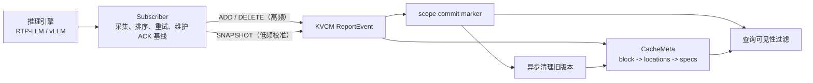
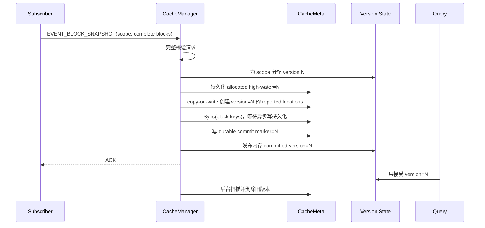

# ReportEvent 增量上报与权威快照设计

## 1. 一句话说明

这套方案把 KV cache 状态同步分成两条路径：

- 日常变化走 `EVENT_BLOCK_ADD` / `EVENT_BLOCK_DELETE`，只更新发生变化的 block；
- 启动、周期校准、事件断档等场景走 `EVENT_BLOCK_SNAPSHOT`，用一份完整清单纠正长期漂移。

Snapshot 是低频的“一次对账”，不是每 50 ms 重发一次全量。高频全量会反复重写所有 block metadata，并触发全实例异步扫描，既浪费 Redis IO，也会放大 KVCM 的后台负载。

## 2. 要解决什么问题

只发增量很省流量，但发送方崩溃、网络重试、事件缺口或本地基线损坏后，KVCM 可能长期保留已经不存在的 block；只发全量容易实现，但每次都要重写完整集合，规模上不可接受。

因此目标是同时满足：

1. 稳态成本与变化量成正比；
2. 低频全量能够权威地删除漏报的旧数据；
3. 新旧版本切换不依赖慢速清理任务；
4. 写一半失败或进程重启时，半份 snapshot 不能被当成完整状态；
5. full-attention、mamba-state 等多个 spec 可以独立增删，也可以被 snapshot 一次性校准；
6. 不引入 `location_id -> block_key` 的持久化反向索引。

## 3. 在整体链路中的位置



三个相关 PR 的职责边界是：

- #236：ReportEvent 基础能力，包括通用 event-report storage、按 `spec_names` 删除组件、host cache state 等；
- #233（本文）：为 ReportEvent 增加真正的权威 snapshot、版本屏障、持久化提交点、恢复和旧版本回收；
- #241：Subscriber，负责从推理引擎采集状态、保证事件顺序、ACK 后推进基线并调用 KVCM。

服务端有 snapshot 能力并不等于链路已经使用 snapshot。Subscriber 必须显式发送 `EVENT_BLOCK_SNAPSHOT`，这套校准语义才会生效。

## 4. 最重要的概念：scope

一份 snapshot 只对下面这个范围负责：

```text
scope = instance_id + reporter host_ip_port + medium
```

可以把它理解为：“某个实例中，某台上报节点的某种介质目前拥有哪些 cache block”。

- 不同 instance 相互隔离；
- 同一物理节点的 `gpu`、`cpu`、`disk` 等 medium 相互隔离；
- 同一 instance 的不同 reporter 相互隔离。

这里的 `host_ip_port` 必须来自 `ReportEventRequest.host_ip_port`。数据 URI 的 host 可能是共享存储或物理存储服务地址，不能拿它代替 reporter 身份。

## 5. 事件语义

| 事件 | 语义 | 典型频率 |
| --- | --- | --- |
| `EVENT_NODE_REGISTER` | 注册 reporter 和介质 | 启动、重连 |
| `EVENT_HEARTBEAT` | 续租并上报节点指标 | 周期性 |
| `EVENT_BLOCK_ADD` | 按 spec name 合并一个 block 的组件 | 高频增量 |
| `EVENT_BLOCK_DELETE` | 按 `spec_names` 删除一个或多个组件 | 高频增量 |
| `EVENT_BLOCK_SNAPSHOT` | 替换 scope 的完整 block/spec 集合 | 低频校准 |
| `EVENT_HOST_DOWN` | reporter 下线并触发 host 级清理 | 终止事件 |

### 5.1 Snapshot 的“完整”含义

一个 `EVENT_BLOCK_SNAPSHOT` 必须满足：

- `blocks` 是该 scope 当前完整的 block 集合；
- 空 `blocks` 表示清空该 scope；
- 每个 reported block 的 `specs` 是该 location 当前完整的组件集合；
- block 不能重复，spec name 不能为空或重复，URI 必须合法；
- snapshot 不能分页，也不能把同一个 scope 拆成多次请求后再拼接；
- 同一 scope 同时只允许一个在途 snapshot。

例如一个 block 同时包含 full-attention 和 mamba-state，snapshot 必须同时带上两者。少带一个的含义不是“这次没更新它”，而是“这个组件已经不存在”。

### 5.2 请求屏障

- Snapshot 和 ADD/DELETE 不能放在同一个 `ReportEvent` 请求中；
- register、heartbeat 可以和 snapshot 同请求；
- `HOST_DOWN` 必须单独请求，不能和任何其他事件并发解释；
- Subscriber 应等待 snapshot ACK，再发送其后的增量事件。

这个 ACK 边界很关键。否则 Subscriber 在 snapshot 写入期间发送的新增 block，可能被 snapshot 的完整集合覆盖掉。

## 6. 数据表示

### 6.1 Location id

纯增量阶段，event-report location 用 reporter 身份构造稳定 id：

```text
kvs#event_report#<medium>#<reporter host_ip_port>
```

Snapshot 使用 copy-on-write location，不覆盖当前可见版本：

```text
kvs#event_report#<medium>#snapshot_v=<version>#<reporter host_ip_port>
```

一个 block 在同一个 reporter/medium/version 下的多个 spec 共用这个 location。版本段放在 reporter host 前面，因此 location id 仍以 `#<host_ip_port>` 结尾，host-down 清理可以兼容增量和 snapshot 数据。

### 6.2 URI 作用域与数据版本

KVCM 为每个 event-report `LocationSpec.uri` 写入前三个作用域参数；snapshot 及其后续增量再携带第四个版本参数：

```text
kvcm_instance_id=<instance_id>
kvcm_host_ip_port=<reporter host_ip_port>
kvcm_medium=<medium>
kvcm_snapshot_version=<version>
```

示例：

```text
event_report://physical-storage:9600/cache/123
  ?size=4096
  &kvcm_instance_id=test_instance
  &kvcm_host_ip_port=192.168.1.1%3A8080
  &kvcm_medium=gpu
  &kvcm_snapshot_version=2
```

作用域参数让 backend 在 snapshot 发生前也能按 instance 精确判断 reporter 存活状态，避免同一个 host 地址出现在多个 instance 时相互串扰。这些 `kvcm_*` 参数属于 KVCM 内部协议，Reporter 上报的原始 URI 不允许预先携带它们。解析历史原型 URI 时仍可回退到 URI host，正式数据始终以 `kvcm_host_ip_port` 为准。

### 6.3 持久化提交点

只有 URI 版本还不够。如果 1000 个 block 只写成功 600 个便失败，进程重启后简单取 URI 最大版本，会把这 600 个 block 错当成完整 snapshot。

因此每个 scope 还有两个 instance-level metadata field：

```text
__event_snapshot_allocated_version__#<host_length>:<host_ip_port><medium> = <high_water_version>
__event_snapshot_version__#<host_length>:<host_ip_port><medium>           = <committed_version>
```

URI 上的版本表示“这条数据由哪个 snapshot 写入”，committed field 表示“哪个 snapshot 已经完整提交”。两者匹配，数据才可见。

High-water field 在写任何 block 之前落盘，保证失败 snapshot 用过的版本不会在重启后复用。否则上次失败遗留的同版本 location，可能在下一次 snapshot commit 时被误激活。

## 7. Snapshot 写入流程



具体顺序是：

1. 先完整校验请求，避免校验中途已经修改数据；
2. 为 scope 分配单调递增版本，并先持久化 allocated high-water；
3. 按 block 写入新的 versioned location 及其完整 specs，不覆盖当前 committed location；
4. 对涉及的 block keys 执行 `Sync`，保证异步 Redis 队列已经持久化；
5. 同步写入 durable commit marker；
6. 发布内存 committed version，查询立即切换到新版本；
7. 返回 ACK，并异步回收旧版本 metadata。

空 snapshot 没有 block 数据需要 Sync，但仍会提交一个新版本。新版本发布后，整个旧 scope 立即不可见，后台再完成物理删除。

## 8. 查询为什么不会读到半份数据

查询路径和 `EventReportBackend::MightExist` 都执行版本判断：

- URI 没有提交版本，且 scope 尚未进入 snapshot 模式：按普通增量数据处理；
- URI 版本等于 scope committed version：可继续检查 reporter 是否存活；
- URI 版本更旧、更高、scope 不匹配或 location 内混有未版本化 spec：不可见。

因此异步清理只负责回收空间，不负责正确性。新版本提交的一瞬间，旧版本已经在逻辑上失效；清理慢或短暂失败不会让旧数据重新可见。

## 9. Snapshot 与后续增量如何配合

Snapshot 提交以后，该 scope 的普通 `EVENT_BLOCK_ADD` 自动继承当前 committed version。

ADD 的合并规则是：

- 同名 spec 覆盖；
- 新 spec 追加；
- 合并前丢弃该 location 中其他 snapshot 版本的遗留 spec；
- 重试同一 ADD 不重复累计容量。

DELETE 继续按 `spec_names` 删除。因此 full-attention 和 mamba-state 可以独立变化；下一次 snapshot 又会用完整 spec 集合纠正任何漂移。

## 10. 失败与重启语义

| 失败位置 | durable marker | 查询结果 | 后续处理 |
| --- | --- | --- | --- |
| 请求校验失败 | 不变 | 旧版本继续可见 | 修正请求后重试 |
| allocated high-water 写失败 | 不变 | 尚未写 block，旧版本继续可见 | 返回失败并重试 |
| 部分 block 写失败 | 不变 | 新写入的半份数据不可见，旧版本完整可见 | 返回 partial；未来 snapshot 清理 |
| `Sync` 失败/超时 | 不变 | 新版本不可见，旧版本完整可见 | 返回失败并重试 |
| commit marker 写失败 | 不变 | 新版本不可见，旧版本完整可见 | 返回失败并重试 |
| marker 成功后、内存发布前崩溃 | 已更新 | 重启后恢复新版本 | 无需回滚 |
| 内存发布后清理失败 | 已更新 | 新版本可见、旧版本不可见 | 指数退避重试，未来 snapshot 仍会再清理 |

KVCM 恢复时不再扫描全实例 location 并猜测最大版本，而是读取 instance metadata 中的 high-water 和 commit markers。恢复成本与 snapshot scope 数量相关，不再与 block 总数相关；marker 损坏会阻止后续 mutation，避免从错误基线继续分配版本。未提交的新 location 与旧 location 使用不同 id，而且失败版本不会复用，因此即使进程在任意 block 写入后崩溃，旧版本也没有被原地破坏，失败残留也不会在重试时意外变成当前版本。

该提交协议依赖 KVCM leader 单写。主备切换会先停止 leader-only 请求，再由新 leader 从持久化 marker 恢复版本。

## 11. 并发与生命周期

- 同一 scope 只有一个 `in_flight` snapshot；不同 host 或 medium 可以并行；
- 版本状态以 `(instance, reporter host, medium)` 为扁平复合 key，避免跨实例串扰；
- 后台清理持有 `EventReportBackend` 的 `shared_ptr`，避免任务执行时 backend 已释放；
- 同一 scope 连续提交多个版本时，只保留最新清理目标；
- 清理失败最多退避重试三次，之后保持查询侧隔离，等待下一次 snapshot 再触发回收；
- CacheManager 析构前先停止并 join 调度线程，避免后台 lambda 访问已经析构的成员；
- HOST_DOWN 清理带 node generation，节点重新注册后旧清理任务会被 fence。

## 12. 性能模型

假设：

- 本次 snapshot 有 `B` 个 block；
- instance 总 metadata 量为 `N`；
- 稳态一个周期变化 `D` 个 block，通常 `D << B <= N`。

成本大致为：

- ADD/DELETE：`O(D)` 写入；
- Snapshot 同步阶段：`O(B)` 校验和写入；
- Snapshot 版本协议：写入一次 allocated high-water 和一次 committed marker；
- Snapshot 异步清理：`O(N)` 扫描，删除目标 scope 的非当前版本 location；
- 重启恢复：`O(S)` 读取 marker，`S` 为 snapshot scope 数量。

本方案不维护反向索引，换来的代价就是低频 `O(N)` 清理。只要 Subscriber 坚持“增量为主、snapshot 校准”，这个取舍成立；如果业务要求每几十毫秒发送全量，应改用持久化反向索引、分区 generation 或引擎原生增量源，而不是提高 snapshot 频率。

Copy-on-write 期间新旧版本会短暂共存，所以目标 scope 的 metadata 峰值约为“旧版本 + 新版本 + 失败残留”；成功后的异步清理会回收旧版本。容量规划不能只按稳态单版本估算。

容量统计按 location 更新前后的实际 URI `size` 差值修正。重复 ADD、重复 snapshot 或 spec 覆盖不会让 usage 单调虚增，DELETE 和后台清理则扣除实际删除量。

## 13. Subscriber 的正确用法

### RTP-LLM

如果引擎只提供全量状态，Subscriber 可以高频轮询，但应在本地维护“最后一次 ACK 的基线”：

1. 当前全量与 ACK 基线做 diff；
2. 发送 ADD/DELETE；
3. 只有 KVCM ACK 后才推进基线；
4. 周期性或基线不可信时，发送一条完整 `EVENT_BLOCK_SNAPSHOT`；
5. Snapshot ACK 后再恢复增量发送。

“周期性把全部 block 再发一遍 ADD”只能刷新已有数据，不能原子地证明遗漏项应被删除，不等价于 authoritative snapshot。

### vLLM

有原生 KV events 时直接发送有序增量；在启动、重连、序列缺口、full-clear 或本地状态不可信时发送 snapshot。Snapshot 仍必须是该 scope 的完整集合。

### 当前联调缺口

截至 #241 的 `d6d7090264f3208eea59cccf155ca09ebe338128`：

1. Subscriber 尚未定义和发送 `BLOCK_SNAPSHOT`，周期校准仍是 full ADD；
2. `BlockRemoved` 构造的 `block_delete` 字段是 `specs`，而 #236/#233 服务端协议要求 `spec_names`。

因此 #233 合入后只是服务端能力就绪。#241 还需要补 snapshot event、ACK 屏障和 delete 字段对齐，端到端闭环才成立。

## 14. 为什么不使用持久化反向索引

另一种做法是为每个 reporter/medium 维护完整的 `location_id -> block_key set`，snapshot 到达时直接计算：

```text
to_add    = reported - existing
to_delete = existing - reported
```

它能避免全实例扫描，但也引入：

- Redis set 与 block metadata 的双写一致性；
- 崩溃后的索引修复；
- 更复杂的迁移、清理和容量成本；
- 多 spec、host down、重试时更多事务边界。

URI version + durable marker 把即时正确性交给版本屏障，把空间回收交给后台扫描，改动更集中。当前前提是 snapshot 低频；如果未来扫描成本成为瓶颈，再用指标数据决定是否引入反向索引。

## 15. 代码地图

- `protocol/proto/meta_service.proto`：event 枚举和 snapshot payload；
- `data_storage/snapshot_uri_utils.h`：scope、URI 参数和 commit marker 编解码；
- `data_storage/event_report_backend.*`：节点状态、版本分配/提交、`MightExist`；
- `manager/cache_manager.cc`：请求校验、写入屏障、持久化提交、恢复、查询过滤和清理调度；
- `manager/meta_searcher.*`：spec merge/replace/delete、usage 差值、metadata marker 和全量扫描；
- `service/http_service/meta_service_http.cc`：HTTP JSON 映射；
- `docs/api/meta_service.md`：外部接口示例。

## 16. 测试与上线检查

单元和集成测试至少覆盖：

- scope 按 instance/host/medium 隔离；
- 在途版本不可见，commit 后新版本可见、旧版本失效；
- high-water/commit marker key 无歧义并可跨 MetaIndexer 重启恢复，失败版本不复用；
- 完整 snapshot 删除遗漏 block，空 snapshot 清空 scope；
- snapshot 替换完整 specs，后续 ADD 继承版本并正确合并；
- 重复 ADD/snapshot 不导致 storage usage 虚增；
- snapshot 与 delta 混发、HOST_DOWN 混发、重复 block/spec、保留 URI 参数均被拒绝；
- 清理失败不会影响查询正确性；
- HTTP 和 gRPC payload 一致；
- ASAN 下 EventReportBackend、MetaSearcher、CacheManager 测试通过。

建议灰度顺序：

1. 先部署理解 snapshot proto、但仍只接收旧增量的 KVCM；
2. 再部署修正 `spec_names` 且支持 snapshot ACK 屏障的 Subscriber；
3. 小流量开启启动 snapshot 和较长周期校准；
4. 观察 snapshot block 数、写入/Sync/marker 延迟、partial 次数、清理扫描耗时与失败重试；
5. 根据 instance 规模调整校准周期，不把 snapshot 当作轮询接口。

## 17. 仍建议补充的可观测性

当前日志能够定位版本提交和清理结果。正式大规模开启前，建议增加以下指标：

- `snapshot_commit_total{result, medium}`；
- `snapshot_block_count`；
- `snapshot_write_latency_ms`、`snapshot_sync_latency_ms`；
- `snapshot_cleanup_scan_keys`、`snapshot_cleanup_latency_ms`、`snapshot_cleanup_retry_total`；
- `snapshot_stale_location_filtered_total`；
- Subscriber 的 event lag、retry count、last ACK sequence 和 last snapshot age。

这些指标能回答三个最实际的问题：snapshot 是否过于频繁、Redis 是否被全量写压住、旧 metadata 是否按预期回收。
